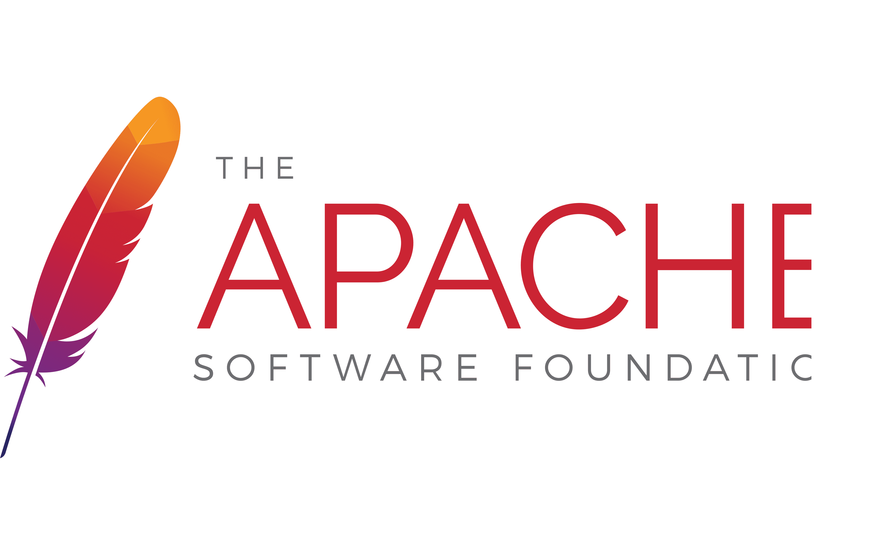

> ### Welcome to my GitHub Repo.

I hope you are well in the time you see my repo and i wish you all the best.
______________________________________________________

> ### Short brief about me:

I'm Hussein Amr Ghoraba, a junior DevOps engineer who graduated from ITI (Information Technology Institute) with a Grade A, and I hope to join your company so that I can use my experience in scripting languages, automation tools, and cloud services to develop high-quality solutions.

I took AWS certification during the period of the internship, which contributed to my time management skills. I also aced a project deploying infrastructure and a secured web app on a cloud provider. I gained management and leadership skills, guiding my colleagues throughout the project and raising optimism in the group. Being exact and on time distinguishes me from my colleagues and is perhaps one of the most useful qualities I can provide.

During my five years of college studies, I finished fourth among my peers. Competition, difficulties, and hard work have always been and will always be a part of my life.
Additionally, I can keep up with and keep a watchful eye on your infrastructure to see exactly how many resources are being used.

Thanks in advance,

Hussein Ghoraba
DevOps Engineer

>> List of my technical skills: 

#### DevOps Stack Tools:

                          

#### Cloud Providers:

 

#### Operating Systems:

#### Scripting Tools:

   

#### Databases:

#### Web-Servers:

   

#### Other programs:

    
