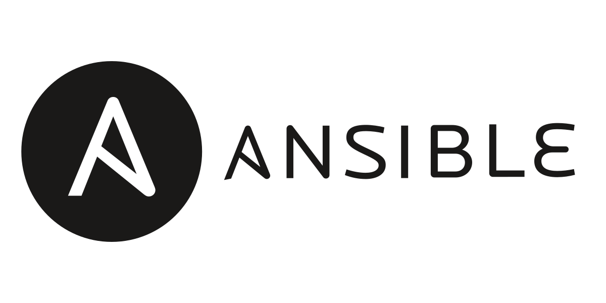

> ### Welcome to my GitHub Repo.

I hope you are well in the time you see my repo and i wish you all the best.
______________________________________________________

> ### Short brief about me:

I'm Hussein Ghoraba a DevOps Engineer who graduated from a ITI-DevOps Engineering track on 02/2023 through this period and before i learned the following skills:

#### DevOps Stack Tools:

                          

#### Cloud Providers:

 

#### Operating Systems:

#### Scripting Tools:

   

#### Databases:

#### Web-Servers:

   

#### Other programs:

    
